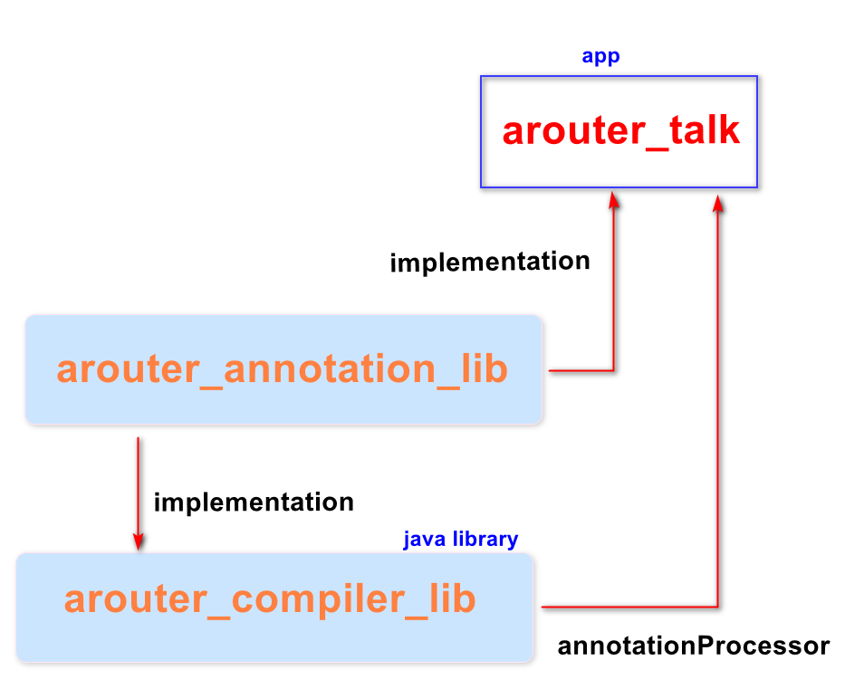

### 模块之间的跳转交互

* EventBus
EventBean非常多(一对一)，一对多就会混乱不堪、难以维护
* 反射
反射技术可以成功，维护成本较高且容易出现高版本@hide限制
* 隐式意图
比较麻烦，需要维护Manifest中的action
* BroadCastReceiver
需要动态注册(7.0后)，需求方发送广播
* 类加载
需要准确的全类名路径,维护成本较高且容易出现人为失误
* 维护一个JavaBean,保存路径和类名

### APT路由

* **APT**

apt是一种处理注释的工具，它对源代码文件进行检测找出其中的Annotation，根据注解自动生成代码,
如果想要自定义的注解处理器能够正常运行，必须要通过APT工具来进行处理。
也可以这样理解，只有通过声明APT工具后，程序在编译期间自定义注解解释器才能执行。

`通俗理解:根据规则，帮我们生成代码、生成类文件`


**相关属性**

|  -- 属性名 --                | -- 解释 --|
| :------: | :------: |
| getEnclosedElements() | 返回该元素直接包含的子元素 |
| getEnclosingElement() | 返回包含该element的父element，与上一个方法相反 |
| getKind()             | 返回element的类型，判断是哪种element |
| getModifiers()        | 获取修饰关键字,入public static final等关键字 |
| getSimpleName()       | 获取名字，不带包名 |
| getQualifiedName()    | 获取全名，如果是类的话，包含完整的包名路径 |
| getParameters()       | 获取方法的参数元素,每个元素是一个VariableElement |
| getReturnType()       | 获取方法元素的返回值 |
| getConstantValue()    | 如果属性变量被final修饰，则可以使用该方法获取它的值 |

* **注解器使用**

1. 定义注解：
```Java

/**
 * <strong>Activity使用的布局文件注解</strong>
 * <ul>
 * <li>@Target(ElementType.TYPE)   // 接口、类、枚举、注解</li>
 * <li>@Target(ElementType.FIELD) // 属性、枚举的常量</li>
 * <li>@Target(ElementType.METHOD) // 方法</li>
 * <li>@Target(ElementType.PARAMETER) // 方法参数</li>
 * <li>@Target(ElementType.CONSTRUCTOR)  // 构造函数</li>
 * <li>@Target(ElementType.LOCAL_VARIABLE)// 局部变量</li>
 * <li>@Target(ElementType.ANNOTATION_TYPE)// 该注解使用在另一个注解上</li>
 * <li>@Target(ElementType.PACKAGE) // 包</li>
 * <li>@Retention(RetentionPolicy.RUNTIME) <br>注解会在class字节码文件中存在，jvm加载时可以通过反射获取到该注解的内容</li>
 * </ul>
 *
 * 生命周期：SOURCE < CLASS < RUNTIME
 * 1、一般如果需要在运行时去动态获取注解信息，用RUNTIME注解
 * 2、要在编译时进行一些预处理操作，如ButterKnife，用CLASS注解。注解会在class文件中存在，但是在运行时会被丢弃
 * 3、做一些检查性的操作，如@Override，用SOURCE源码注解。注解仅存在源码级别，在编译的时候丢弃该注解
 */

@Target(ElementType.TYPE)         // 该注解作用在类之上
@Retention(RetentionPolicy.CLASS) // 要在编译时进行一些预处理操作。注解会在class文件中存在
public @interface ARouter {

    // 详细路由路径（必填），如："/app/MainActivity"
    String path();

    // 路由组名（选填，如果开发者不填写，可以从path中截取出来）
    String group() default "";
}

```
2. 定义注解处理器

```java
// AutoService则是固定的写法，加个注解即可
// 通过auto-service中的@AutoService可以自动生成AutoService注解处理器，用来注册
// 用来生成 META-INF/services/javax.annotation.processing.Processor 文件
@AutoService(Processor.class)
// 允许/支持的注解类型，让注解处理器处理（新增annotation module）
@SupportedAnnotationTypes({"com.netease.annotation.ARouter"})
// 指定JDK编译版本
@SupportedSourceVersion(SourceVersion.RELEASE_7)
// 注解处理器接收的参数
@SupportedOptions("content")
public class ARouterProcessor extends AbstractProcessor {

    // 操作Element工具类 (类、函数、属性都是Element)
    private Elements elementUtils;

    // type(类信息)工具类，包含用于操作TypeMirror的工具方法
    private Types typeUtils;

    // Messager用来报告错误，警告和其他提示信息
    private Messager messager;

    // 文件生成器 类/资源，Filter用来创建新的源文件，class文件以及辅助文件
    private Filer filer;

    // 该方法主要用于一些初始化的操作，通过该方法的参数ProcessingEnvironment可以获取一些列有用的工具类
    @Override
    public synchronized void init(ProcessingEnvironment processingEnvironment) {
        super.init(processingEnvironment);
        // 父类受保护属性，可以直接拿来使用。
        // 其实就是init方法的参数ProcessingEnvironment
        // processingEnv.getMessager(); //参考源码64行
        elementUtils = processingEnvironment.getElementUtils();
        messager = processingEnvironment.getMessager();
        filer = processingEnvironment.getFiler();

        // 通过ProcessingEnvironment去获取build.gradle传过来的参数
        String content = processingEnvironment.getOptions().get("content");
        // 有坑：Diagnostic.Kind.ERROR，异常会自动结束，不像安卓中Log.e那么好使
        messager.printMessage(Diagnostic.Kind.NOTE, content);
    }

    /**
     * 相当于main函数，开始处理注解
     * 注解处理器的核心方法，处理具体的注解，生成Java文件
     *
     * @param set              使用了支持处理注解的节点集合（类 上面写了注解）
     * @param roundEnvironment 当前或是之前的运行环境,可以通过该对象查找找到的注解。
     * @return true 表示后续处理器不会再处理（已经处理完成）
     */
    @Override
    public boolean process(Set<? extends TypeElement> set, RoundEnvironment roundEnvironment) {
        if (set.isEmpty()) return false;

        // 获取所有带ARouter注解的 类节点
        Set<? extends Element> elements = roundEnvironment.getElementsAnnotatedWith(ARouter.class);
        // 遍历所有类节点
        for (Element element : elements) {
            // 通过类节点获取包节点（全路径：com.netease.xxx）
            String packageName = elementUtils.getPackageOf(element).getQualifiedName().toString();
            // 获取简单类名
            String className = element.getSimpleName().toString();
            messager.printMessage(Diagnostic.Kind.NOTE, "被注解的类有：" + className);
            // 最终想生成的类文件名
            String finalClassName = className + "$$ARouter";

            // 公开课写法，也是EventBus写法（https://github.com/greenrobot/EventBus）
            try {
                // 创建一个新的源文件（Class），并返回一个对象以允许写入它
                JavaFileObject sourceFile = filer.createSourceFile(packageName + "." + finalClassName);
                // 定义Writer对象，开启写入
                Writer writer = sourceFile.openWriter();
                // 设置包名
                writer.write("package " + packageName + ";\n");

                writer.write("public class " + finalClassName + " {\n");

                writer.write("public static Class<?> findTargetClass(String path) {\n");

                // 获取类之上@ARouter注解的path值
                ARouter aRouter = element.getAnnotation(ARouter.class);

                writer.write("if (path.equals(\"" + aRouter.path() + "\")) {\n");

                writer.write("return " + className + ".class;\n}\n");

                writer.write("return null;\n");

                writer.write("}\n}");

                // 最后结束别忘了
                writer.close();
            } catch (IOException e) {
                e.printStackTrace();
            }
        }

        return true;
    }
}

```

3. 项目 build.gradle下添加阿里云镜像

```Groovy
// 阿里云镜像，为了路由使用
        maven { url 'https://maven.aliyun.com/repository/public' }
        maven { url 'https://maven.aliyun.com/repository/google' }
        maven { url 'https://maven.aliyun.com/repository/gradle-plugin' }
```

4. 在注解处理器的java library下添加Auto-Service并依赖注解java library

```Groovy

dependencies {
    implementation fileTree(dir: 'libs', include: ['*.jar'])

    // 注册注解，并对其生成META-INF的配置信息，rc2在gradle5.0后有坑
    compileOnly'com.google.auto.service:auto-service:1.0-rc4'
    annotationProcessor'com.google.auto.service:auto-service:1.0-rc4'

    // 引入annotation，让注解处理器-处理注解
    implementation project(':arouter_annotation_lib')
}

```

5. 注解处理器类

继承 javax.annotation.processing.AbstractProcessor 并添加类注解 `@AutoService(Processor.class)`

```java
// AutoService则是固定的写法，加个注解即可
// 通过auto-service中的@AutoService可以自动生成AutoService注解处理器，用来注册
// 用来生成 META-INF/services/javax.annotation.processing.Processor 文件
@AutoService(Processor.class)
// 允许/支持的注解类型，让注解处理器处理（新增annotation module）
@SupportedAnnotationTypes({"com.jesen.arouter_annotation_.ARouter"})
// 指定JDK编译版本
@SupportedSourceVersion(SourceVersion.RELEASE_7)
// 注解处理器接收的参数
@SupportedOptions("content")
public class ARouterProcessor extends AbstractProcessor {

    // 操作Element工具类 (类、函数、属性都是Element)
    private Elements elementUtils;

    // type(类信息)工具类，包含用于操作TypeMirror的工具方法
    private Types typeUtils;

    // 用来输出错误，警告等日志信息
    private Messager messager;

    // 文件生成器 类/资源，Filter用来创建新的源文件，class文件以及辅助文件
    private Filer filer;

    /**
     * 该方法主要用于一些初始化的操作，通过该方法的参数ProcessingEnvironment可以获取一些列有用的工具类
     * */
    @Override
    public synchronized void init(ProcessingEnvironment processingEnv) {
        super.init(processingEnv);
        elementUtils = processingEnv.getElementUtils();
        typeUtils = processingEnv.getTypeUtils();
        messager = processingEnv.getMessager();
        filer = processingEnv.getFiler();

        // 通过ProcessingEnvironment去获取build.gradle传过来的参数
        String content = processingEnv.getOptions().get("content");
        // 有坑：Diagnostic.Kind.ERROR，异常会自动结束，不像安卓中Log.e那么好使
        messager.printMessage(Diagnostic.Kind.NOTE, content);
    }

    @Override
    public Set<String> getSupportedAnnotationTypes() {
        return super.getSupportedAnnotationTypes();
    }

    /**
     * 通过指定jdk版本
     * */
    @Override
    public SourceVersion getSupportedSourceVersion() {
        return super.getSupportedSourceVersion();
    }

    /**
     * 用来接收外部传入的参数
     * */
    @Override
    public Set<String> getSupportedOptions() {
        return super.getSupportedOptions();
    }

    /**
     * 相当于main函数，开始处理注解
     * 注解处理器的核心方法，处理具体的注解，生成Java文件
     *
     * @param annotations              使用了支持处理注解的节点集合（类 上面写了注解）
     * @param roundEnv 当前或是之前的运行环境,可以通过该对象查找找到的注解。
     * @return true 表示后续处理器不会再处理（已经处理完成）
     */
    @Override
    public boolean process(Set<? extends TypeElement> annotations, RoundEnvironment roundEnv) {
        if (annotations.isEmpty()){
            return false;
        }
        // 获取项目中所有使用了ARouter注解的节点
        Set<? extends Element> elements = roundEnv.getElementsAnnotatedWith(ARouter.class);

        // 遍历所有类节点
        for (Element element : elements) {
            // 包节点，类节点的上一个节点
            String packageName  = elementUtils.getPackageOf(element).getQualifiedName().toString();
            // 获取类的simpleName
            String className = element.getSimpleName().toString();
            messager.printMessage(Diagnostic.Kind.NOTE,"ARouterProcessor 被注解的类： "+ className);

            // 想要生成的类文件,如 MainActivity$ARouter
            String finalClassName = className + "$ARouter";

            /**
             * EventBus也继承了 AbstractProcessor， 一行行拼接出了最终类文件
             * */

            try {
                JavaFileObject sourceFile = filer.createSourceFile(packageName + "." + finalClassName);
                // 定义Writer对象，开启写入
                Writer writer = sourceFile.openWriter();
                // 设置包名
                writer.write("package " + packageName + ";\n");

                writer.write("public class " + finalClassName + " {\n");

                writer.write("public static Class<?> findTargetClass(String path) {\n");

                // 获取类之上@ARouter注解的path值
                ARouter aRouter = element.getAnnotation(ARouter.class);

                writer.write("if (path.equals(\"" + aRouter.path() + "\")) {\n");

                writer.write("return " + className + ".class;\n}\n");

                writer.write("return null;\n");

                writer.write("}\n}");

                // 最后关闭
                writer.close();
            } catch (IOException e) {
                e.printStackTrace();
            }
        }
        return true;
    }
}

```

6. 配置

app的build.gradle下面添加,注解处理器的init方法就可以接收到
```Groovy
// 在gradle文件中配置选项参数值（用于APT传参接收）,必须写在defaultConfig节点下
        javaCompileOptions {
            annotationProcessorOptions {
                arguments = [content : 'jesen apt']
            }
        }
```
并且在 dependencies下添加注解和注解处理器依赖：

```Groovy
dependencies {

    // 添加注解
    implementation project(':arouter_annotation_lib')
    // 添加注解处理器
    annotationProcessor project(':arouter_compiler_lib')
    // ...
   }
```

7. 测试

为MainActivity设置注解：
```java

@ARouter(path = "/app/MainActivity")
public class MainActivity extends AppCompatActivity {

    @Override
    protected void onCreate(Bundle savedInstanceState) {
        super.onCreate(savedInstanceState);
        setContentView(R.layout.activity_main);
    }
}

```

**最终生成的文件路径：**
`build/generated/ap_generated_sources/debug/out/com/jesen/arouter_talk/MainActivity$ARouter.java`

最终会被打包在apk.


