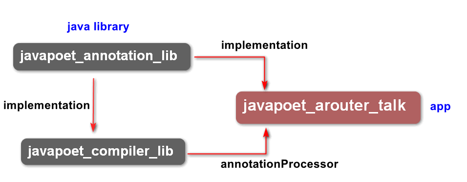

# APT + JavaPoet


### JavaPoet

* APT + JavaPoet =超级利刃

JavaPoet是square推出的开源java代码生成框架，提供Java Api生成.java源文件这个框架功能非常实用，也是我们习惯的Java面向对象OOP语法
可以很方便的使用它根据注解生成对应代码
通过这种自动化生成代码的方式，
可以让我们用更加简洁优雅的方式要替代繁琐冗杂的重复工作
[JavaPoet项目主页及源码:] (https://github.com/square/javapoet)

```Groovy
// apt 需要的依赖，注册注解处理器
annotationProcessor 'com.google.auto.service:auto-service:1.0-rc4'
compileOnly 'com.google.auto.service:auto-service:1.0-rc4'

// JavaPoet 需要的依赖
// 依赖JavaPoet库,帮助我们通过类调用的形式来生成Java代码
implementation "com.squareup:javapoet: 1.9.0"
```

*  JavaPoet中常用的类

| 类对象             | 说明|
| :------: | :------: |
| MethodSpec         | 代表一个构造函数或方法声明 |
| TypeSpec           | 代表一个类，接口,或者枚举声明 |
| FieldSpec          | 代表一个成员变量,一个字段声明 |
| JavaFile           | 包含一个顶级类的Java文件 |
| ParameterSpec      | 用来创建参数 |
| AnnotationSpec     | 用来创建注解 |
| ClassName          | 用来包装一个类 |
| TypeName           | 类型，如在添加返回值类型使用TypeName.VOID |

* JavaPoet中字符串格式化

| 符号             | 用途|
| :------: | :------: |
| $L  | 字面量，如: "int value=$L", 8 |
| $S  | 字符串,如:$S, "position" |
| $T  | 类、接口，如:$T, MainActivity |
| $N  | 变量，如:user.$N, name |

* javapoet的实现跟普通apt实现是一样的，只有在生成类的方式上有一些不同，具体不同在下面方法对新文件生成的设置：

```java

 @Override
    public boolean process(Set<? extends TypeElement> annotations, RoundEnvironment roundEnv) {
        if (annotations.isEmpty()) {
            return false;
        }
        // 获取所有带ARouter注解的 类节点,并遍历
        Set<? extends Element> elements = roundEnv.getElementsAnnotatedWith(PARouter.class);
        for (Element element : elements) {
            // 通过类节点获取包节点路径
            String packageName = elementUtils.getPackageOf(element).getQualifiedName().toString();
            String className = element.getSimpleName().toString();
            messager.printMessage(Diagnostic.Kind.NOTE, "---the class being annotation is: " + className);
            // 最终想生成的类文件名
            String finalClassName = className + "$$PARouter";

            // javapoet ,butterknife就是用了JavaPoet
            // 高级写法，javapoet构建工具，参考（https://github.com/JakeWharton/butterknife）
            try {
                // 获取类之上@ARouter注解的path值
                PARouter aRouter = element.getAnnotation(PARouter.class);

                // 构建方法体
                MethodSpec method = MethodSpec.methodBuilder("findTargetClass") // 方法名
                        .addModifiers(Modifier.PUBLIC, Modifier.STATIC)
                        .returns(Class.class) // 返回值Class<?>
                        .addParameter(String.class, "path") // 参数(String path)
                        // 方法内容拼接：
                        // return path.equals("/app/MainActivity") ? MainActivity.class : null
                        .addStatement("return path.equals($S) ? $T.class : null",
                                aRouter.path(), ClassName.get((TypeElement) element))
                        .build(); // 构建

                // 构建类
                TypeSpec type = TypeSpec.classBuilder(finalClassName)
                        .addModifiers(Modifier.PUBLIC) //, Modifier.FINAL)
                        .addMethod(method) // 添加方法体
                        .build(); // 构建

                // 在指定的包名下，生成Java类文件
                JavaFile javaFile = JavaFile.builder(packageName, type)
                        .build();
                javaFile.writeTo(filer);
            } catch (IOException e) {
                e.printStackTrace();
            }
        }

        return true;
    }
```


